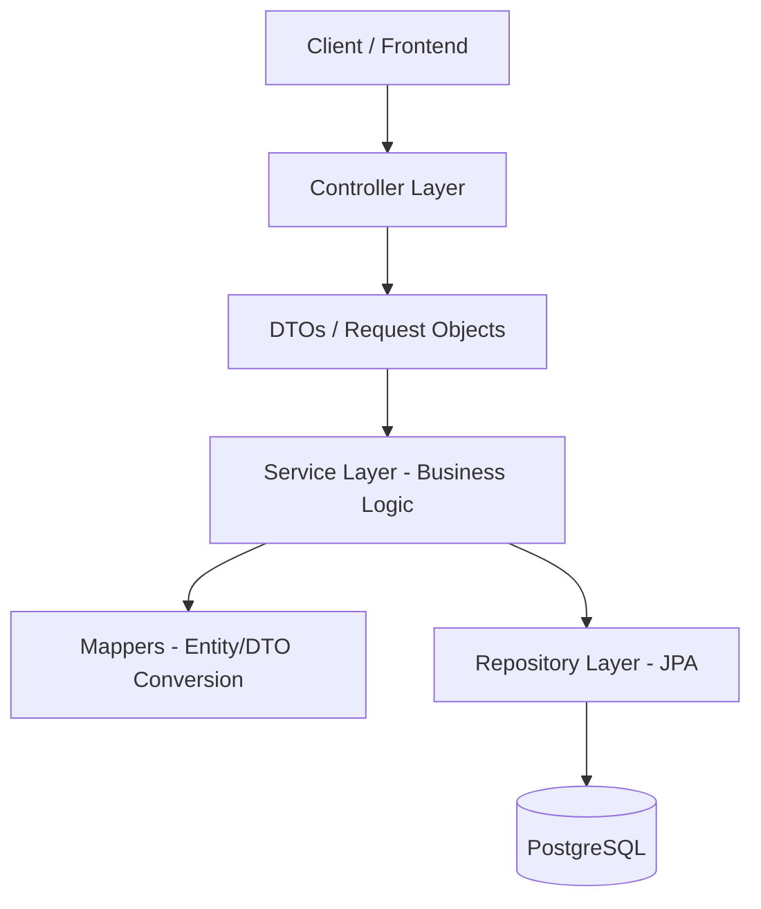

# API-barbershop-v2


## Sobre o Projeto

A **API-barbershop-v2** é uma solução robusta e escalável desenvolvida para o gerenciamento completo de barbearias. O sistema permite o agendamento de horários, gestão de serviços e oferece uma base sólida para expansão de funcionalidades de negócio.

### Problema Resolvido

Tradicionalmente, barbearias enfrentam dificuldades no controle de agenda e na gestão dinâmica de seus serviços. Esta API resolve esses gargalos ao centralizar a inteligência de negócio em um backend performático, permitindo integrações fáceis com frontends modernos e sistemas de notificação.

---

## Tecnologias Utilizadas

- **Linguagem:** Java 21 (LTS)
- **Framework:** Spring Boot 4.0.6
- **Persistência:** Spring Data JPA / Hibernate
- **Banco de Dados:** PostgreSQL (Produção), H2 (Testes)
- **Documentação:** OpenAPI 3 / Swagger (SpringDoc)
- **Containerização:** Docker & Docker Compose
- **Ferramentas de Desenvolvimento:** Lombok, MapStruct
- **CI/CD:** GitHub Actions
- **Qualidade/Testes:** JUnit 5, Mockito, AssertJ

---

## Arquitetura e Decisões Técnicas

O projeto segue uma abordagem de **Modular Monolith** com forte inspiração em **Clean Architecture**, visando o isolamento de domínios e a facilidade de evolução.

### Diagrama de Fluxo (Mermaid)



### Principais Decisões:

1.  **Isolamento por Módulos:** A estrutura é dividida em módulos de domínio, garantindo que mudanças em um contexto não afetem outros inadvertidamente.
2.  **DTOs como Boundary Objects:** Proteção do modelo de dados interno (Entities) através de objetos de transferência, evitando vazamento de lógica de infraestrutura para o cliente.
3.  **Soft Delete:** Implementado nativamente no módulo de produtos para garantir a integridade histórica dos agendamentos, mesmo que um serviço seja "removido".
4.  **Auditoria Automatizada:** Uso de `@EnableJpaAuditing` para controle automático de `createdAt` e `updatedAt`.
5.  **Tratamento Global de Exceções:** Padronização de respostas de erro para facilitar a integração com o frontend.

---

## Estrutura de Pastas

```text
src/main/java/com/moisas/barbershop/
├── configuration/          # Configurações globais (CORS, JPA Auditing)
├── modules/
│   ├── appointment/        # Domínio de Agendamentos
│   │   ├── controller/
│   │   ├── dto/
│   │   ├── entity/
│   │   ├── repository/
│   │   └── service/
│   └── product/            # Domínio de Serviços/Produtos
│       ├── controller/
│       ├── dto/
│       ├── entity/
│       ├── mapper/
│       ├── repository/
│       └── service/
└── shared/                 # Componentes transversais (Exceções, DTOs genéricos)
```

---

## Infraestrutura e CI/CD

### Pipeline CI/CD (GitHub Actions)
O fluxo automatizado garante a qualidade do código a cada push:
1.  **Checkout:** Extração do código fonte.
2.  **Setup Java:** Configuração do ambiente JDK 21.
3.  **Build & Package:** Compilação do projeto via Maven.
4.  **Tests:** Execução de testes unitários e de integração com banco de dados em memória.
5.  **Artifact:** Geração do JAR pronto para deploy.

### Dockerização
A aplicação está preparada para rodar em containers, utilizando **Multi-stage builds** no Dockerfile para otimizar o tamanho da imagem final e garantir que apenas o necessário para a execução (JRE) seja incluído.

---

## Segurança e Qualidade

- **CORS:** Configurado para aceitar origens específicas.
- **Validação:** Uso rigoroso de `Bean Validation` (`@Valid`, `@NotBlank`, `@DecimalMin`) para garantir a integridade dos dados de entrada.
- **Estratégia de Testes:**
    - **Unitários:** Focados na lógica de serviços e mappers.
    - **Integração:** Validação do fluxo completo entre Controller e Banco de Dados.
    - **Padrão AAA:** Todos os testes seguem o padrão *Arrange, Act, Assert*.

---

## Como Executar

### Pré-requisitos
- Docker & Docker Compose
- JDK 21 (opcional para execução via Docker)
- Maven 3.9+

### Execução via Docker (Recomendado)

1.  Suba o banco de dados:
    ```bash
    docker-compose up -d
    ```
2.  Faça o build e execute a aplicação:
    ```bash
    docker build -t barbershop-api .
    docker run -p 8080:8080 --name barbershop-app --network host barbershop-api
    ```

### Execução Local

1.  Certifique-se que o PostgreSQL está rodando.
2.  Configure as variáveis de ambiente ou altere o `application.properties`.
3.  Execute o comando:
    ```bash
    ./mvnw spring-boot:run
    ```

---

## Documentação da API

A documentação interativa (Swagger) pode ser acessada após a execução em:
- **Swagger UI:** `http://localhost:8080/swagger-ui/index.html`
- **OpenAPI JSON:** `http://localhost:8080/v3/api-docs`

---

